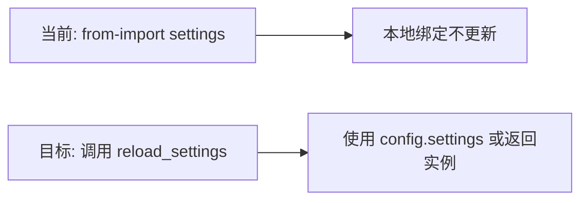

# 1. 问题

在支持运行时重载配置的工程中，部分文件使用 `from config import settings` 将全局配置绑定为局部名称。重载后全局 `settings` 指向的新实例不会自动更新到该局部绑定，容易出现读取过期配置的情况。涉及位置：`SingleEngineApp/test_st.py` 第 3-11 行。

## 1.1. **from-import 形成不可更新的本地快照**
- 具体位置：`SingleEngineApp/test_st.py` 第 3 行 `from config import settings`，第 7 行读取 `settings.FAST_TEST_MODE`。
- 问题原因：`reload_settings()` 会重新创建并赋值模块级变量 `config.settings`。但 `from-import` 在导入时复制了对象引用到局部命名空间，之后不会随着模块变量的再绑定而更新。
- 影响：测试脚本或调试输出可能展示旧配置；在需要“最新配置”的场景下造成误判。

示例（现状）：
```python
# SingleEngineApp/test_st.py
from config import settings
print(f"DEBUG: FAST_TEST_MODE: {settings.FAST_TEST_MODE}")
# 之后若其他地方调用了 reload_settings()，本文件的 settings 仍指向旧实例
```

## 1.2. **顶层阶段读取配置，缺少显式的“获取最新”语义**
- 顶层代码一旦执行完导入语句，局部绑定就固定下来；没有统一的“获取当前配置”的接口或调用点。
- 心智负担：开发者需要记住“哪些地方要最新值，哪些地方可以旧值”，容易误用。

# 2. 收益

改为模块属性访问或显式获取最新配置，统一语义为“读取到当下有效的配置”，减少过期引用风险。

## 2.1. **降低误用风险**
- 通过禁止 `from config import settings`，避免产生不可更新的快照引用。

## 2.2. **提升测试与调试准确性**
- 在切换 `.env` 或环境变量、调用 `reload_settings()` 后，日志与测试输出能反映最新配置。

## 2.3. **减少心智负担**
- 统一为“模块属性”或“显式获取”的模式，开发者不必区分不同文件的引用差异。

# 3. 方案

总体思路：约束配置引用方式，禁止 `from config import settings`；在需要最新值的场景使用模块属性 `config.settings` 或调用 `reload_settings()` 返回的新实例。

## 3.1. **替换写法：解决“from-import 本地快照”**

方案概览：
- 在需要最新配置的入口（测试脚本、Streamlit 子应用入口、任务启动脚本等），使用 `reload_settings()` 明确刷新。
- 其他模块读取配置时，统一通过模块属性 `config.settings` 或通过一个轻量的访问器函数 `get_settings()` 获取。

实施步骤：
- 步骤1：全局代码检索，定位所有 `from config import settings` 的使用点。
- 步骤2：将其替换为以下两种之一：
    - 模块属性访问：`import config` 后用 `config.settings`。
    - 显式刷新并绑定：`from config import reload_settings`，随后 `settings = reload_settings()`。
- 步骤3（可选优化）：在 `config.py` 中添加 `get_settings()` 访问器，便于统一语义。

修改前（`SingleEngineApp/test_st.py`）：
```python
from config import settings
print(f"DEBUG: FAST_TEST_MODE: {settings.FAST_TEST_MODE}")
```

修改后方案 A（模块属性访问，必要时刷新）：
```python
import config
# 在需要最新值的场景显式刷新
config.reload_settings()
print(f"DEBUG: FAST_TEST_MODE: {config.settings.FAST_TEST_MODE}")
```

修改后方案 B（显式获取最新配置实例）：
```python
from config import reload_settings
settings = reload_settings()  # 返回最新的 Settings 实例
print(f"DEBUG: FAST_TEST_MODE: {settings.FAST_TEST_MODE}")
```

（可选）在 `config.py` 增加访问器以统一语义：
```python
# config.py
from typing import TYPE_CHECKING
if TYPE_CHECKING:
    from .config import Settings

def get_settings() -> "Settings":
    return settings  # 始终返回当前模块内的最新实例
```

然后调用：
```python
from config import get_settings, reload_settings
reload_settings()
settings = get_settings()
print(f"DEBUG: FAST_TEST_MODE: {settings.FAST_TEST_MODE}")
```

流程示意：


该图展示了从“不可更新的局部快照”改为“显式刷新且统一读取”的路径。重点关注节点 D，确保所有读取点取到最新配置。

# 4. 回归范围

本次改动主要影响“读取配置”的行为，应从端到端场景验证“刷新后读取到最新值”。

## 4.1. 主链路
- 切换 `.env` 中 `FAST_TEST_MODE` 或在环境变量中修改同名键。
- 执行 `reload_settings()` 的入口（如 Streamlit 应用启动、测试脚本顶部）。
- 验证日志与输出的 `FAST_TEST_MODE` 是否与最新配置一致。

示例用例：
- 预置条件：`.env` 中 `FAST_TEST_MODE=false`。
- 操作步骤：运行 `test_st.py`，观察输出；随后将 `.env` 改为 `FAST_TEST_MODE=true` 并再次运行（或在运行中调用 `reload_settings()`）。
- 期望结果：两次输出分别反映对应值，重载后输出为 `true`。

## 4.2. 边界情况
- 多次连续调用 `reload_settings()`：应每次都返回最新实例。
- 与模块属性混用：在使用 `config.settings` 的文件中，确保没有残留的 `from-import settings`。
- 仅启动时读取一次的常量场景：明确文档说明该处不要求“最新值”，避免误解。
